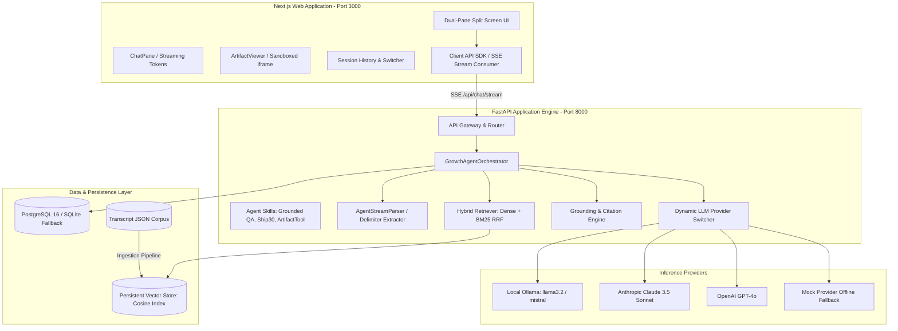

# Technical Architecture Specification
## The Lenny Growth Assistant — System Design & Engineering Blueprint

---

## 1. High-Level Architecture Overview



---

## 2. Ingestion & RAG Retrieval Pipeline

### 2.1 Chunking Strategy
- **Window Size**: 400–600 tokens per chunk.
- **Overlap**: 100 tokens to preserve conversational context across speaker turn boundaries.
- **Contextual Header Prefix**: Every chunk is injected with a structured header:
  ```
  [EPISODE: EP-142 | TITLE: Brian Chesky on Founder Mode | GUEST: Brian Chesky | TIMESTAMP: 00:02:11 - 00:06:45]
  ```
  This ensures that sparse lexical queries matching speaker names or episode titles consistently surface high-relevance chunks.

### 2.2 Hybrid Retrieval with Reciprocal Rank Fusion (RRF)
To balance semantic conceptual matching (e.g., *"protecting craft agency"*) and keyword terminology (e.g., *"LNO framework"*, *"40% PMF rule"*), retrieval combines:
1. **Dense Vector Search**: Normalized cosine similarity over dense embedding representations.
2. **Sparse Lexical Search**: BM25Okapi keyword matching over tokenized transcript stems.
3. **Reciprocal Rank Fusion (RRF)**:
   $$\text{Score}_{\text{RRF}}(d) = \frac{w_{\text{dense}}}{k + \text{rank}_{\text{dense}}(d)} + \frac{w_{\text{sparse}}}{k + \text{rank}_{\text{sparse}}(d)}$$
   where $k = 60$, $w_{\text{dense}} = 0.6$, and $w_{\text{sparse}} = 0.4$.

---

## 3. Database Persistence Schema (PostgreSQL & SQLite)

```
┌─────────────────────────────────────────────────────────────┐
│                          SESSIONS                           │
├─────────────────────────────────────────────────────────────┤
│ id (UUID, PK)                                               │
│ title (VARCHAR 255)                                         │
│ llm_provider (VARCHAR 50)                                   │
│ created_at (TIMESTAMP)                                      │
│ updated_at (TIMESTAMP)                                      │
│ metadata_json (JSONB)                                       │
└───────────────────────┬─────────────────────────────────────┘
                        │ 1:N Cascade
        ┌───────────────┴───────────────┐
        ▼                               ▼
┌───────────────────────────┐   ┌───────────────────────────┐
│         MESSAGES          │   │         ARTIFACTS         │
├───────────────────────────┤   ├───────────────────────────┤
│ id (UUID, PK)             │   │ id (UUID, PK)             │
│ session_id (UUID, FK)     │   │ session_id (UUID, FK)     │
│ role (VARCHAR 20)         │   │ title (VARCHAR 255)       │
│ content (TEXT)            │   │ type (VARCHAR 50)         │
│ citations_json (JSONB)    │   │ content (TEXT)            │
│ provider (VARCHAR 50)     │   │ version (INTEGER)         │
│ model (VARCHAR 50)        │   │ created_at (TIMESTAMP)    │
│ latency_ms (FLOAT)        │   │ metadata_json (JSONB)     │
│ created_at (TIMESTAMP)    │   └───────────────────────────┘
└───────────────────────────┘
```

---

## 4. Multi-LLM Dynamic Routing & Resilient Fallbacks

The system implements the `BaseLLMProvider` interface across four concrete engines:
- **`OllamaProvider`**: Direct HTTP connection to `http://localhost:11434` for local streaming.
- **`AnthropicProvider`**: Native Async Anthropic client for Claude 3.5 Sonnet.
- **`OpenAIProvider`**: Async OpenAI client for GPT-4o.
- **`MockLocalProvider`**: Deterministic offline generator ensuring continuous end-to-end testing.

### Fallback Decision Matrix
```
[User Request]
       │
       ▼
 [LLMManager.route()]
       │
       ├── Provider Healthy? ───► YES ───► Execute Turn & Stream Tokens
       │
       └── NO / Connection Error
             │
             ├── If Local Ollama Offline: Log audit warning -> Fallback to Mock Local Provider
             └── If Cloud Rate Limited: Fallback to Local Provider -> Emit 'is_fallback: true'
```

---

## 5. Claude Artifacts & Iframe Sandbox Security

When an LLM response includes rich executable HTML/CSS/JS or interactive widgets, it encapsulates them inside structured delimiters:
```
<<<ARTIFACT title="CAC to LTV Interactive Calculator" type="html">>>
<!DOCTYPE html>
<html>
  <head><style>...</style></head>
  <body>...<script>...</script></body>
</html>
<<<END_ARTIFACT>>>
```

### Security Controls:
1. **Isolated `<iframe>` Execution**: The generated HTML is loaded exclusively in an isolated iframe.
2. **Restricted Sandbox Attributes**: The iframe is mounted with `sandbox="allow-scripts"`. The following hazardous capabilities are strictly omitted:
   - `allow-top-navigation` (prevents redirecting the host app)
   - `allow-same-origin` (prevents reading host cookies, localStorage, or session tokens)
   - `allow-modals` (prevents prompt/alert hijacking)
   - `allow-popups` (prevents opening untrusted child tabs)
3. **Delimiter Parsing Isolation**: `AgentStreamParser` strips the raw artifact text from the primary chat display so the chat pane remains clean and readable.
